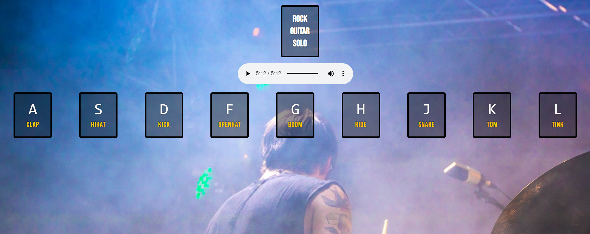

# drum_kit

## Sobre la applicacion
Drum kit es un proyecto en javascript vanilla. 
La misma tiene un pista de guitarra que se acciona con el mouse y los simuladores de bateria con las letras del teclado:
**A - S - D - F - G - H - J - K - L**

*Esta version no se puede usar con pantallas tactiles, solo con teclado*
